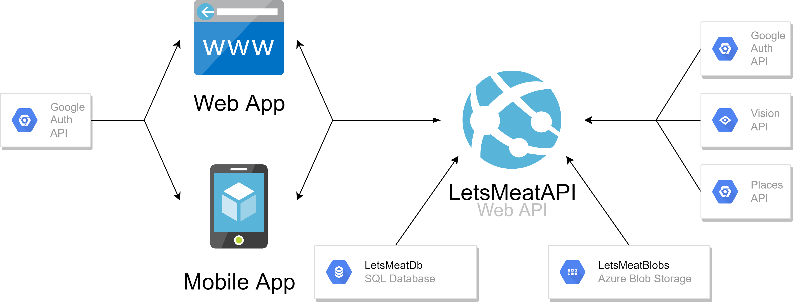
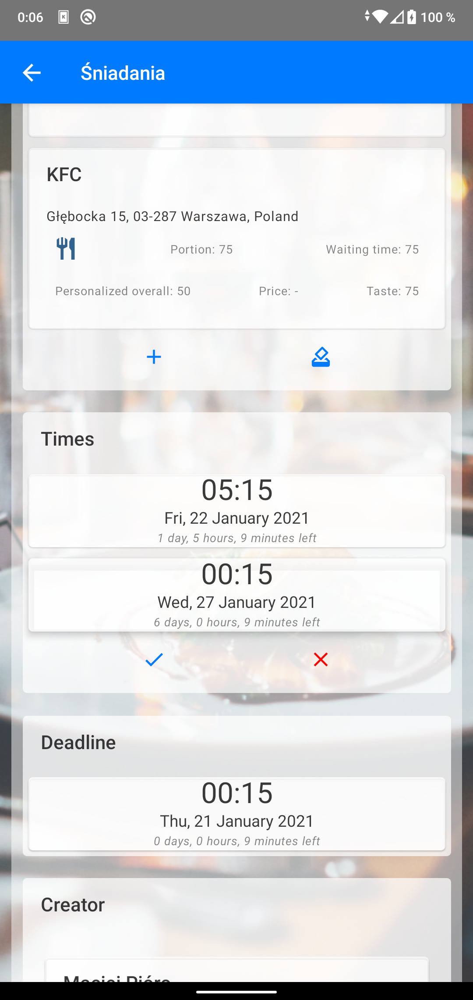
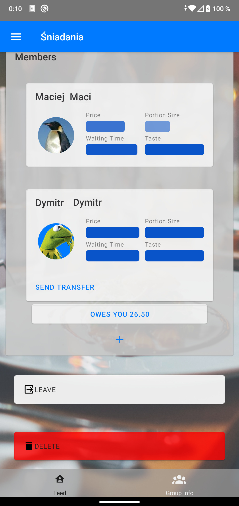
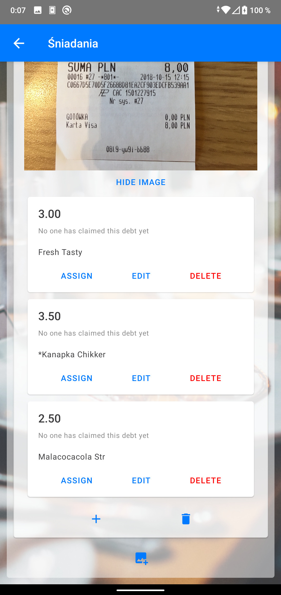
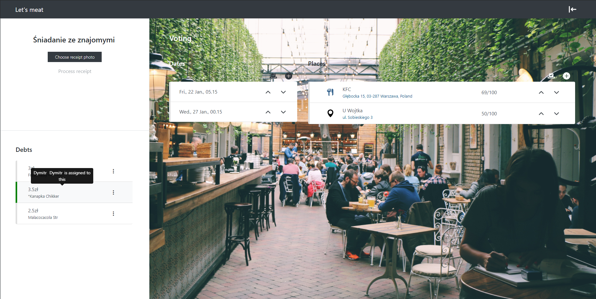
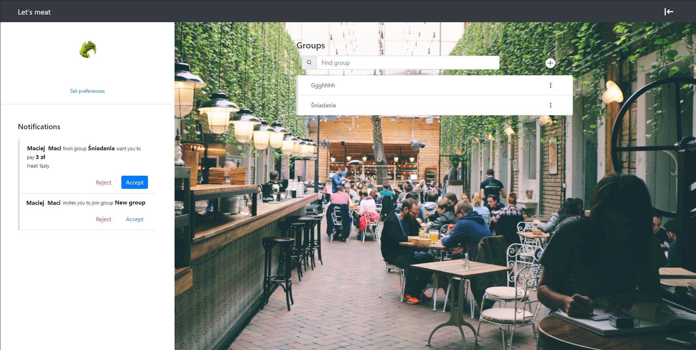

# Let's Meat   Application for selecting group activity with debts settlement functionality

This repository contains the source code of the BSc dissertation submitted in February 2021 at the Warsaw University of Technology.

## Project description
The project was aimed at providing users with a solution, which will allow them to organize meetings with friends, and settle debts with each other. As a result, we designed a 3-part system:
1. Web application
2. Android mobile application
3. Azure cloud server

Both web and mobile applications provide the same functionality. The server holds all system logic and serves both apps all necessary data. General system architecture can be found below:

## Project scope
The app allows you to create group events and choose their location and time. Candidate locations can be entered manually or using a search engine that works with Google Maps. The proposals of places where the event can be organized are subject to voting. The system allows the user to enter their own preferences. Preferences mean on which feature (e.g. quality of served food or price) user cares most. Based on the preferences, the system suggests to the user which vote best reflects his or her preferences.

Additionally, the application provides a module supporting financial settlements between the group members. Users can enter photos of bills paid by them. Items from the photos are automatically read, and the read data is used as a basis for settlements. The system constantly simplifies the debt structure in the group, minimizing the number of transactions and their total value.

The target group for the product are young people: pupils, students, young adults. However, anyone who needs to organize group meetings regularly in an efficient way will be able to use it.

## Debt reduction algorithm
One of the features of our application is debt settlement functionality. It allows users to take notes of debts between each other, and the app will try and simplify them where possible. This way, number of transactions needed to pay everybody off is minimal. The algorithm is as follows:
1. Assume a weighted directed graph G (weight = amount of money owed > 0) without loops.
2.  If there exists no cycle in G, go to 4.
3.  Find a cycle C in G. Subtract the smallest weight on C from all weights on edges from C. Then, remove all edges from G with weight = 0
4.  Find the longest path P in G. If |P|=1, G is fully reduced
5.  Subtract the smallest weight on P from all weights on edges from P. Connect first and last vertex from P with an edge with that weight. Remove all edges from G with weight = 0
6.  Go to 4

Visualization of the above algorithm can be found below:
<table>
    <tr>
        <td>
            
            
Reduction by cycle

        </td>
        <td>
            
            
Reduction by path

        </td>
    </tr>
</table>
<table>
    <tr>
        <td>
            
            
Reduction by path &nbsp;

        </td>
        <td>
            
            
Reduction by path again Graph is fully reduced

        </td>
    </tr>
</table>

## Screenshots
<table>
    <tr>
        <td></td>
        <td></td>
        <td></td>
    </tr>
</table>

